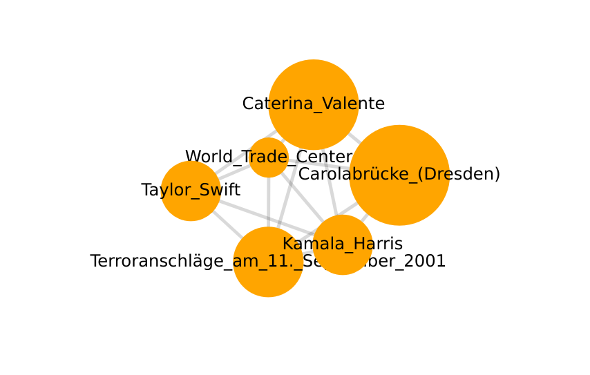

# 📊 Wikipedia Trending Article Analysis (DE)

**Explore the connections between trending Wikipedia articles!**  
This project analyzes time-based peaks in Wikipedia (DE) article traffic to uncover correlations—whether they're meaningful or coincidental.

---

## 📜 Problem Statement

1. Fetching trending Wikipedia articles and their traffic data
2. Analyzing peaks in views for correlations in timing and content
3. Visualizing connections to highlight interesting trends

---

## 🔍 Example Insights
- **Meaningful Connections**: The **Linkin Park reunion** led to traffic spikes for the band’s Wikipedia page, as well as for related topics like individual band members and Scientology as it is linked to the family of the new lead singer Emily Armstrong.
- **Coincidental Peaks**: **Taylor Swift** and the **Carola Bridge in Dresden** saw traffic spikes on **September 11** as well as the **Terror Act from 2001**, but only due to date-related curiosity—not shared content.

These patterns illustrate how different factors influence public interest and online activity. Whether one can acually gain topic relation knowledge from peak correlations or might be tricked by pure coincidence is to be observed with caution.

## 📸 Screenshots

### Simple Example Traffic Spike Plot
  
*A plot showing traffic spikes for "Emily Armstrong" due to Linkin Park reunion*

Check out the notebook for more graphs!

### "Correlation" Graph
  
*A graph illustrating connections between articles based on peak timings.*
*The circle size indicates the article view dimension and hovering the edges reveals the correlation coefficient between cirlces. Plotted with a threshold to the correlation coefficient*

### "Coincident" Graph
  

### Viewing the Plot Locally

After generating the data using the notebook, you can easily view the force graph by following these steps:

1. Navigate to the directory
2. Start a local HTTP server using the following command:
   ```bash
   python -m http.server
3. Visit http://127.0.0.1:8000 locally
